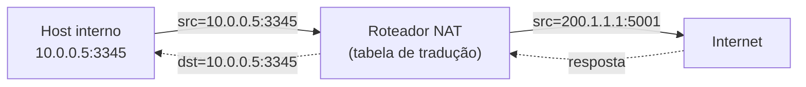
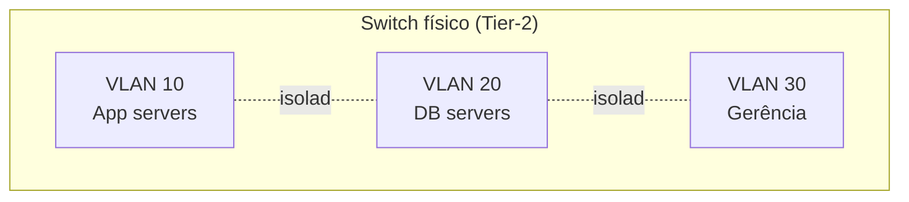
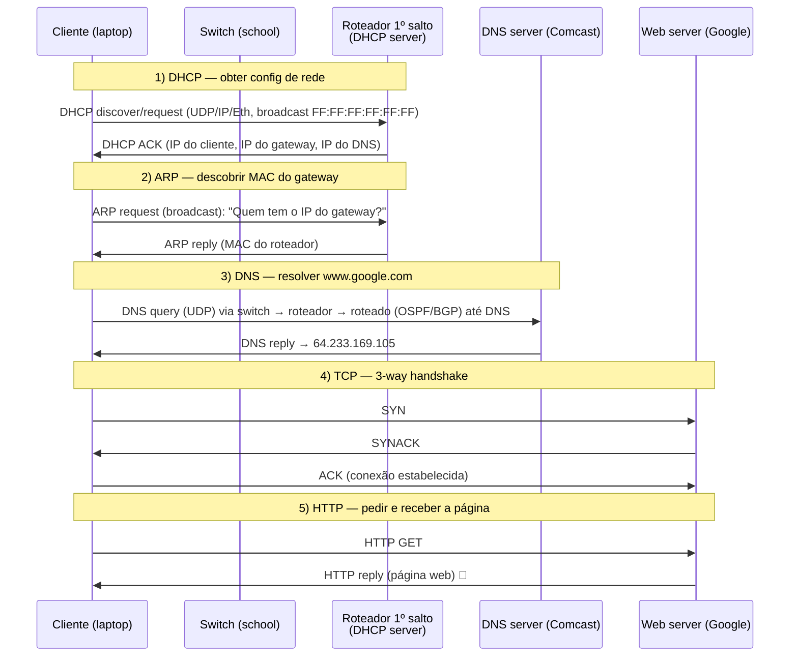
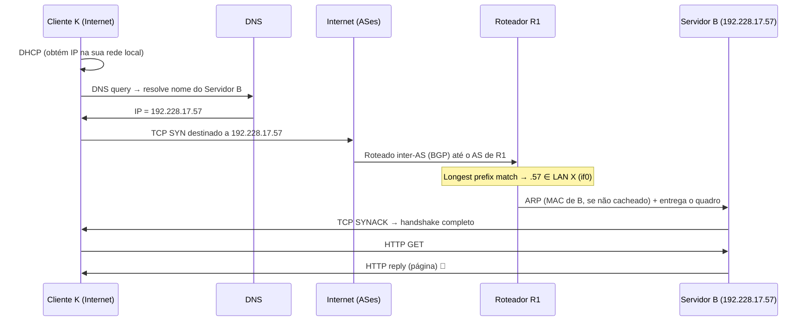
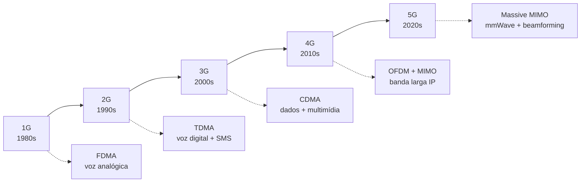
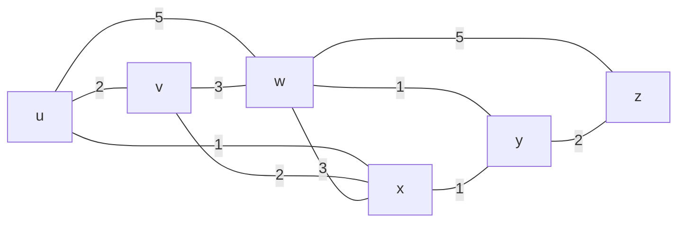
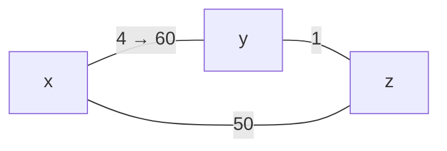

# 📘 Gabarito Completo e Comentado — Prova 3

**Disciplina:** Redes de Computadores (Kurose & Ross, 9ª ed.) · **Escopo:** Camada de Rede / Plano de Controle · Camada de Enlace · Introdução às Redes Sem Fio

> Cada questão traz **(A) a explicação do tópico** e depois **(B) a resposta-gabarito**, no formato que combinamos. Os pontos críticos estão marcados com 💡.

---

## 🗺️ Mapa da prova

| Q   | Tema                                                                         | Tipo                   | Prioridade                                   |
| --- | ---------------------------------------------------------------------------- | ---------------------- | -------------------------------------------- |
| 1   | Plano de controle, SDN, ARP, algoritmos de roteamento                        | V/F                    | Alta                                         |
| 2   | NAT + VLAN em datacenter                                                     | Dissertativa + figura  | Média                                        |
| 3   | "Um dia na vida de uma requisição web" (school → google)                     | Integradora (14 itens) | **Altíssima**                                |
| 4   | Cenário com 2 sub-redes, tabela de encaminhamento (/27)                      | Cálculo + dissertativa | Alta                                         |
| 5   | Evolução das redes móveis 1G → 5G                                            | Dissertativa           | Média                                        |
| 6   | Algoritmos: estado de enlace (Dijkstra) e vetor de distâncias (Bellman-Ford) | Conceitual + cálculo   | **Altíssima**                                |
| 7   | CSMA/CD                                                                      | Dissertativa           | ⚠️ Fora do escopo da P3 (seção 6.3 excluída) |

---

# Questão 1 — V/F: Plano de Controle, SDN, ARP e Roteamento

## (A) Explicação dos tópicos

**Encapsulamento dos protocolos de controle** — nem todos vão "direto no IP":

| Protocolo | Plano    | Transporte/Encapsulamento                 |
| --------- | -------- | ----------------------------------------- |
| **ICMP**  | Controle | Dentro do datagrama **IP** (protocolo 1)  |
| **OSPF**  | Controle | Diretamente sobre **IP** (protocolo 89)   |
| **RIP**   | Controle | Sobre **UDP** (porta 520)                 |
| **BGP**   | Controle | Sobre **TCP** (porta 179) — _path vector_ |

**As 4 características da arquitetura SDN** (slide Cap. 5):

1. Encaminhamento generalizado baseado em fluxo (OpenFlow, _match + action_)
2. **Separação entre plano de dados e plano de controle** ← a mais "esquecida"
3. Funções de controle externas aos comutadores (controlador em software)
4. Rede programável via aplicações de controle

**ARP entre sub-redes diferentes:** o ARP só resolve IP→MAC **no mesmo segmento de enlace**. Para um destino em outra sub-rede, o host entrega o quadro ao **gateway (roteador)** — faz ARP pelo MAC do gateway, e graças ao **cache ARP**, não a cada envio.

**Famílias de algoritmos de roteamento:**

| Família             | Algoritmo    | Protocolo | Métrica            |
| ------------------- | ------------ | --------- | ------------------ |
| Estado de enlace    | Dijkstra     | **OSPF**  | custo do enlace    |
| Vetor de distâncias | Bellman-Ford | **RIP**   | saltos (hops)      |
| Vetor de caminhos   | —            | **BGP**   | política + AS-PATH |

## (B) Gabarito — **todas FALSAS**

**( F )** _ICMP, OSPF e BGP são do plano de controle e encapsulados diretamente em IP ou quadro de enlace._
→ ICMP e OSPF vão direto sobre IP, mas o **BGP roda sobre TCP** (porta 179), não direto no datagrama IP. Falsa pelo BGP. _(ICMP = Internet **Control** Message Protocol.)_

**( F )** _O SDN tem apenas 3 características._
→ São **4**; a frase omite a **separação plano de dados/controle**, que é o pilar central do SDN.

**( F )** _Sempre que um host de A enviar para um host de B, faz ARP para todos da rede A._
→ Como B está em **outra sub-rede**, o host faz ARP pelo **MAC do gateway**, não do host de B. E por causa do **cache ARP**, não é "sempre".

**( F )** _OSPF usa estado de enlace; RIP usa vetor de caminhos._
→ OSPF (estado de enlace) está certo, mas o **RIP usa vetor de distâncias**. Vetor de caminhos é o **BGP**.

---

# Questão 2 — NAT + VLAN no Datacenter

## (A) Explicação dos tópicos

**NAT (Network Address Translation)** — traduz endereços IP privados internos ↔ IP público externo. Mantém uma tabela de tradução `(IP privado, porta) ↔ (IP público, porta)`.

**Benefícios do NAT no datacenter:**

- **Segurança/privacidade:** os servidores usam **IP privado** (`10.0.0.0/8`, `192.168.0.0/16`), invisíveis da Internet. Um atacante externo não consegue endereçar diretamente um servidor — só o que o NAT expõe.
- **Escalabilidade de endereçamento:** milhares de servidores compartilham poucos IPs públicos.

**VLAN (Virtual LAN)** — particiona um switch físico em **múltiplos domínios de broadcast lógicos**. Cada porta é atribuída a uma VLAN; tráfego de uma VLAN não "vaza" para outra sem passar por um roteador.

**Benefícios da VLAN no datacenter:**

- **Desempenho:** confina o tráfego de **broadcast** (ARP, DHCP) a domínios menores → menos inundação, menos colisões lógicas, melhor uso da banda.
- **Segurança/isolamento:** separa _tenants_/camadas (front-end, app, banco) mesmo compartilhando o mesmo switch físico; comunicação entre VLANs passa obrigatoriamente por roteador/firewall, onde se aplicam ACLs.

## (B) Gabarito (resposta + posicionamento na figura)

> Resposta-modelo (≤ 8 linhas):

"O **NAT** deve ser posicionado no **border router** (ou access router): os _server racks_ usam **IP privado** e o NAT os mascara atrás de IP(s) público(s), melhorando **segurança** (servidores não endereçáveis de fora) e **escalabilidade** de endereçamento. As **VLANs** devem ser configuradas nos **Tier-1/Tier-2 e TOR switches**, agrupando logicamente os racks por função (ex.: VLAN de aplicação × VLAN de banco). Isso **isola domínios de broadcast** (menos inundação ARP/DHCP → mais **desempenho**) e impede comunicação direta entre camadas sensíveis sem passar por roteador/firewall (mais **segurança**)."

**Na figura:** circule o **border router** e escreva "NAT" (seta para os server racks indicando IP privado). Circule os **Tier-2/TOR switches** e desenhe blocos "VLAN A / VLAN B" agrupando racks distintos.

💡 **Reflexão:** NAT atua na **borda** (perímetro norte-sul), VLAN atua **internamente** (segmentação leste-oeste). Eles são complementares: NAT protege contra o _exterior_; VLAN organiza e protege o _interior_.

---

# Questão 3 — ⭐ Um Dia na Vida de uma Requisição Web (school → google)

**Cenário:** cliente conecta o laptop à _school network_ (`68.80.2.0/24`), passa pela _Comcast network_ (`68.80.0.0/13`) e busca `www.google.com` no _web server_ (`64.233.169.105`) na _Google's network_.

## (A) Explicação + ordem cronológica dos protocolos

### Itens 1–14 da questão (todos abordados)

1. **DHCP** — primeiro de tudo. O laptop não tem nada; envia DHCP (UDP→IP→Ethernet) em **broadcast**. O servidor DHCP (no roteador) responde com o **DHCP ACK** contendo: IP do cliente, IP do **roteador de 1º salto** e IP do **servidor DNS**.
2. **ARP** — antes de mandar o primeiro quadro para fora da LAN (a query DNS), o cliente precisa do **MAC do roteador**. Faz **ARP request** (broadcast); o roteador responde com **ARP reply** (seu MAC).
3. **IP público** — o servidor web (`64.233.169.105`) tem IP **público**, alcançável globalmente. É o destino final dos pacotes.
4. **Switch (aprende MAC como?)** — **autoaprendizagem (self-learning):** ao receber um quadro, o switch grava `(MAC origem, porta de entrada)` na tabela de comutação. Para encaminhar, consulta o MAC de **destino**; se desconhecido, faz **flooding** (inunda todas as portas, exceto a de entrada).
5. **Roteador (encaminha como?)** — usa **longest prefix match** na tabela de encaminhamento sobre o **IP de destino**, decrementa o **TTL** e **reencapsula** o datagrama num novo quadro de enlace a cada salto. 💡 O **IP destino é constante fim-a-fim**; o **MAC muda a cada salto**.
6. **VLAN** — no datacenter da Google, agrupa servidores logicamente, isola broadcast e separa funções (item detalhado na Q2).
7. **Broadcast/Difusão** — ocorre no **DHCP discover** (dest `FF:FF:FF:FF:FF:FF`) e no **ARP request**. Switch faz flooding de quadros de destino desconhecido/broadcast **dentro da mesma VLAN/LAN**.
8. **OSPF** — protocolo **intra-AS** (estado de enlace, Dijkstra) que constrói as tabelas de roteamento **dentro** da school/Comcast/Google. (Detalhado na Q6.)
9. **IP privativo/falso** — hosts internos podem usar IP privado atrás de NAT: economiza endereços públicos e oculta a topologia interna (segurança).
10. **Escalabilidade** — provida por **endereçamento hierárquico (CIDR)**, **DNS**, hierarquia de **ASes + BGP** e **NAT/MPLS**. Permite a Internet crescer sem explodir as tabelas.
11. **Segurança/privacidade** — **NAT** (oculta hosts), **VLAN** (isolamento), IP privado.
12. **NAT** — traduz IP privado ↔ público na borda (detalhado na Q2).
13. **BGP** — protocolo **inter-AS** (_path vector_, sobre TCP) que faz o roteamento **entre** os ASes (school ISP → Comcast → Google).
14. **MPLS** — comutação por **rótulos (labels)**: encaminhamento rápido e **engenharia de tráfego** nos núcleos dos provedores; funciona como "enlace virtual" entre roteadores.

## (B) Gabarito — sequência cronológica resumida

> **DHCP → ARP → DNS → TCP (SYN/SYNACK/ACK) → HTTP (GET/reply).**
> Pano de fundo: **switch** (autoaprendizagem de MAC), **roteador** (longest prefix match, TTL, troca de MAC por salto), **OSPF** (rotas intra-AS) e **BGP** (rotas inter-AS) garantindo a entrega ponta-a-ponta; **NAT/VLAN/MPLS** dando segurança, isolamento e escalabilidade.

---

# Questão 4 — Cenário com 2 Sub-redes e Tabela de Encaminhamento

**Dados:** Cliente K (vindo da Internet, sem IP local), Servidor Web **B = 192.228.17.57**, máscara em R1 = **255.255.255.224**.

## (A) Explicação + cálculo de sub-redes

A máscara `255.255.255.224` em binário no último octeto é `11100000`:

$$\text{prefixo} = 24 + 3 = /27 \quad\Rightarrow\quad \text{hosts por sub-rede} = 2^{(32-27)} - 2 = 2^5 - 2 = 30$$

Faixas das sub-redes (blocos de 32 endereços):

| Sub-rede  | Endereço de rede   | Faixa utilizável | Broadcast | Membros              |
| --------- | ------------------ | ---------------- | --------- | -------------------- |
| **LAN X** | `192.228.17.32/27` | `.33 – .62`      | `.63`     | A=`.33`, **B=`.57`** |
| **LAN Y** | `192.228.17.64/27` | `.65 – .94`      | `.95`     | C=`.65`, D=`.66`     |

💡 Confirmação: `192.228.17.57` está entre `.33` e `.62` → o Servidor B pertence à **LAN X**. Esse é o "match" que o roteador R1 fará.

### Tabela de encaminhamento (simplificada) de R1

| Prefixo de destino               | Máscara           | Interface de saída |
| -------------------------------- | ----------------- | ------------------ |
| `192.228.17.32/27` (LAN X)       | `255.255.255.224` | `if0` (LAN X)      |
| `192.228.17.64/27` (LAN Y)       | `255.255.255.224` | `if1` (LAN Y)      |
| `0.0.0.0/0` (default → Internet) | `0.0.0.0`         | `if2` (uplink)     |

Por **longest prefix match**, um pacote para `.57` casa com `192.228.17.32/27` → sai por `if0`.

### Fluxo de protocolos (requisição vinda da Internet)

## (B) Gabarito — resposta-modelo

1. **DHCP:** o Cliente K obtém IP, gateway e DNS na **sua** rede local.
2. **DNS:** resolve o nome do servidor → `192.228.17.57`.
3. **BGP:** roteamento **inter-AS** leva o pacote pelos provedores/ASes até o AS que contém R1.
4. **OSPF:** roteamento **intra-AS** dentro da rede de R1 monta as tabelas locais.
5. **R1 / encaminhamento:** aplica **longest prefix match**; `.57` casa com `192.228.17.32/27` (LAN X) → encaminha por `if0`.
6. **ARP:** R1 descobre o **MAC de B** (`.57`) na LAN X (se não estiver no cache) e entrega o quadro.
7. **TCP:** handshake (SYN / SYNACK / ACK) entre K e B.
8. **HTTP:** GET → resposta com a página, roteada de volta a K pelo caminho inverso.

---

# Questão 5 — Evolução das Redes Móveis (1G → 5G)

## (A) Explicação dos tópicos

| Geração | Década | Acesso/Multiplexação             | Serviços principais                                    | Características                                                 |
| ------- | ------ | -------------------------------- | ------------------------------------------------------ | --------------------------------------------------------------- |
| **1G**  | 1980s  | **FDMA**                         | Voz (analógica)                                        | Antena única; só voz; AMPS/NMT                                  |
| **2G**  | 1990s  | **TDMA** (e CDMA no IS-95)       | Voz digital, **SMS**, dados lentos                     | GSM/GPRS/EDGE (2.5/2.75G); digitalização                        |
| **3G**  | 2000s  | **CDMA** (W-CDMA/UMTS)           | Foto, vídeo, **Internet móvel**, redes sociais         | Até ~4 antenas; HSPA; banda larga inicial                       |
| **4G**  | 2010s  | **OFDM(A) + MIMO**               | **Vídeo/streaming**, pagamento móvel                   | LTE/LTE-Advanced; rede **toda IP**; até ~16 antenas; **eNodeB** |
| **5G**  | 2020s  | **OFDM + Massive MIMO + mmWave** | **AR/VR**, IoT massivo (**IoE**), ultra baixa latência | Beamforming; _ultra-dense networking_; ~128 antenas             |

**Conceitos transversais:**

- **FDMA** divide o espectro em **faixas de frequência**; **TDMA** divide em **fatias de tempo**; **CDMA** usa **espalhamento espectral** (todos transmitem na banda toda, separados por **códigos**); **OFDMA** usa subportadoras ortogonais.
- **Padronização:** ITU, IEEE (802.11), **3GPP** (3G/LTE/5G).
- **Espectro licenciado** (celular, ex.: 4G/5G — exclusivo do operador, QoS garantida) × **não licenciado** (Wi-Fi — compartilhado, sujeito a interferência).

## (B) Gabarito — resposta-modelo

"As redes celulares evoluíram de **1G** (FDMA, voz analógica) para **2G** (TDMA, voz digital + SMS), **3G** (CDMA, multimídia e Internet móvel), **4G** (OFDM+MIMO, rede toda-IP com vídeo/streaming) e **5G** (Massive MIMO, mmWave e beamforming, com AR/VR, IoT massivo e latência ultrabaixa). A cada geração, mudaram a **técnica de acesso múltiplo** (FDMA→TDMA→CDMA→OFDMA), aumentou a **taxa de dados** e o número de **antenas**, e os serviços passaram de **voz** para **dados de banda larga e aplicações imersivas**."

---

# Questão 6 — ⭐ Algoritmos: Estado de Enlace e Vetor de Distâncias

## (A) Explicação dos tópicos

### 6.1 Estado de Enlace (Link-State) — Dijkstra · usado pelo OSPF

- **Informação:** cada nó conhece o **grafo completo** (inunda LSAs com o estado de seus enlaces).
- **Cálculo:** roda **Dijkstra** localmente para achar os caminhos de menor custo a todos os destinos.
- **Natureza:** **centralizada por nó** (cada um tem visão global).

**Algoritmo (pseudocódigo):**

$$
D(v) = \min\big(\,D(v),\; D(w) + c_{w,v}\,\big)
$$

onde $D(v)$ é o custo conhecido até $v$ e $c_{w,v}$ é o custo direto $w\to v$.

**Exemplo canônico (origem = u):**

| Passo | N′     | D(v),p  | D(w),p  | D(x),p  | D(y),p | D(z),p  |
| ----- | ------ | ------- | ------- | ------- | ------ | ------- |
| 0     | u      | 2,u     | 5,u     | **1,u** | ∞      | ∞       |
| 1     | ux     | **2,u** | 4,x     | —       | 2,x    | ∞       |
| 2     | uxy    | **2,u** | 3,y     | —       | —      | 4,y     |
| 3     | uxyv   | —       | **3,y** | —       | —      | 4,y     |
| 4     | uxyvw  | —       | —       | —       | —      | **4,y** |
| 5     | uxyvwz | —       | —       | —       | —      | —       |

**Caminhos mínimos a partir de u:** `u→x` (1), `u→v` (2), `u→x→y` (2), `u→x→y→w` (3), `u→x→y→z` (4).

### 6.2 Vetor de Distâncias (Distance-Vector) — Bellman-Ford · usado pelo RIP

- **Informação:** cada nó conhece só **os vizinhos** e troca **vetores de distância** periodicamente.
- **Cálculo:** **equação de Bellman-Ford**, de forma **iterativa, assíncrona e distribuída**.

$$
D_x(y) = \min_{v}\big\{\, c_{x,v} + D_v(y) \,\big\}
$$

**Exemplo (Bellman-Ford):** custo de $u$ até $z$, com vizinhos $v,x,w$:

$$
D_u(z) = \min\{\,2+5,\; 1+3,\; 5+3\,\} = \min\{7,4,8\} = \mathbf{4} \quad(\text{via } x)
$$

**Problema do count-to-infinity ("más notícias viajam devagar"):**

Se o enlace $x\!-\!y$ sobe de 4 para 60, $y$ vê que $z$ anuncia "tenho caminho a $x$ por 5", então calcula 6 (via $z$) — mas $z$ usava $y$. Eles se reanunciam mutuamente, subindo 7, 8, 9… lentamente (contagem até o infinito). **Soluções:** _split horizon_ e _poisoned reverse_.

### 6.3 Comparação LS × DV

| Critério            | Estado de Enlace (LS)    | Vetor de Distâncias (DV)               |
| ------------------- | ------------------------ | -------------------------------------- |
| Visão               | Grafo **global**         | Só **vizinhos**                        |
| Complexidade de msg | $O(n^2)$ (inundação)     | troca local; varia                     |
| Convergência        | rápida; pode **oscilar** | varia; **loops** e _count-to-infinity_ |
| Robustez a falha    | erro fica local          | erro **se propaga** (black-holing)     |
| Protocolo           | OSPF                     | RIP                                    |

## (B) Gabarito — resposta-modelo

"O **estado de enlace (OSPF)** dá a cada roteador a **visão completa** da topologia (via inundação de LSAs) e roda **Dijkstra** para os menores caminhos — convergência rápida, erros locais. O **vetor de distâncias (RIP)** é **distribuído**: cada nó conhece só os vizinhos, troca vetores de distância e aplica **Bellman-Ford** ($D_x(y)=\min_v\{c_{x,v}+D_v(y)\}$) iterativamente — mais simples, mas sujeito a **loops** e ao **count-to-infinity**, mitigado por _split horizon_ e _poisoned reverse_."

---

# Questão 7 — CSMA/CD ⚠️ (fora do escopo da P3)

> **Atenção:** a seção 6.3 (CSMA/CD) foi **excluída** do conteúdo da Prova 3. Incluo abaixo só por completude — não invista tempo de estudo aqui.

**CSMA/CD (Carrier Sense Multiple Access with Collision Detection):** protocolo de acesso múltiplo da Ethernet clássica (half-duplex). O nó **escuta o meio** (carrier sense) antes de transmitir; se livre, transmite; **detecta colisão** durante a transmissão; se colidir, **aborta**, envia _jam signal_ e espera um tempo aleatório por **backoff exponencial binário** antes de tentar de novo.

---

## 🎯 Cola final (revisão de 1 minuto)

- **BGP** = TCP/179, _path vector_, inter-AS. **OSPF** = IP/89, estado de enlace, intra-AS. **RIP** = UDP/520, vetor de distâncias.
- **SDN** = **4** características (não esqueça a **separação plano dados/controle**).
- **ARP** só resolve no mesmo enlace; destino remoto → ARP pelo **gateway** + **cache**.
- **IP destino constante** fim-a-fim; **MAC muda a cada salto**.
- **Ordem do "dia na vida":** DHCP → ARP → DNS → TCP → HTTP.
- **/27** = `255.255.255.224` = 30 hosts; blocos de 32 endereços.
- **Switch** = autoaprendizagem; **roteador** = longest prefix match + TTL.
- **Móveis:** FDMA(1G) → TDMA(2G) → CDMA(3G) → OFDM+MIMO(4G) → Massive MIMO/mmWave(5G).
- **Dijkstra**: visão global, $O(n^2)$. **Bellman-Ford**: distribuído, count-to-infinity (split horizon / poisoned reverse).
