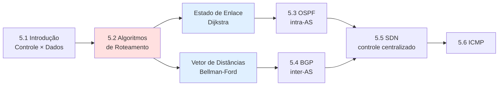
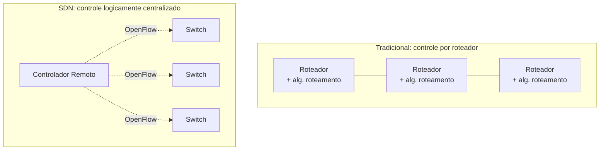
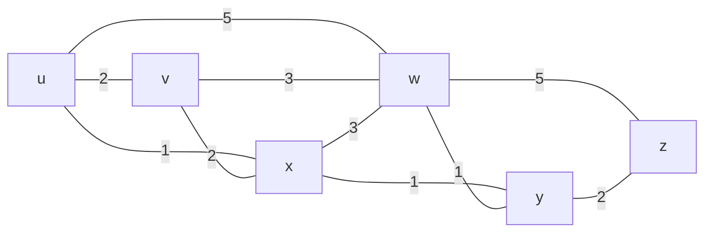
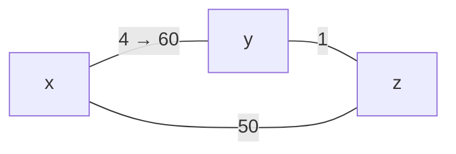
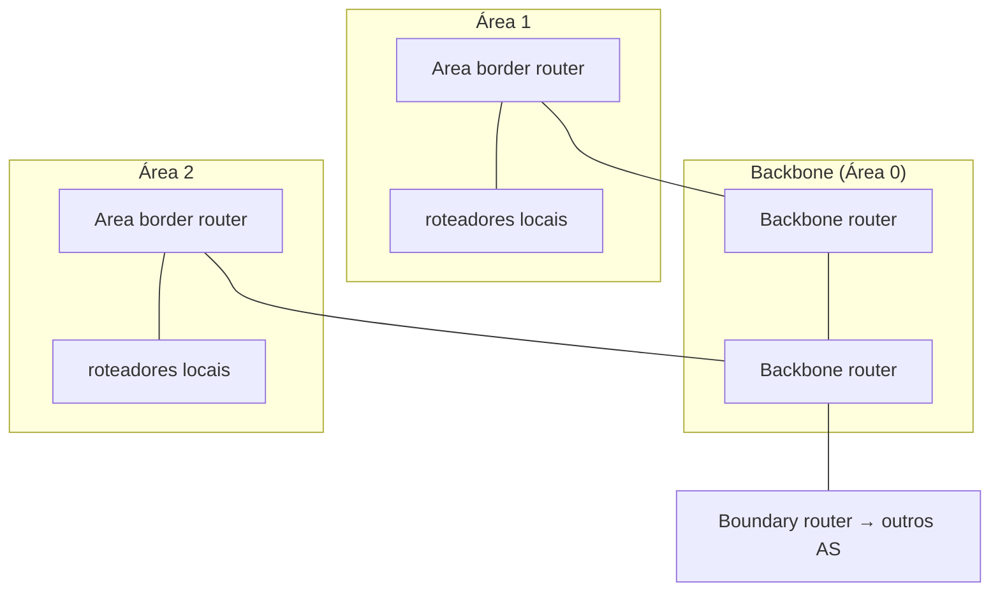
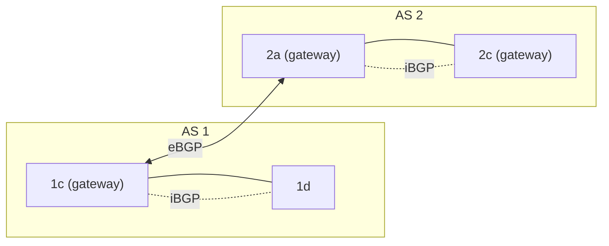
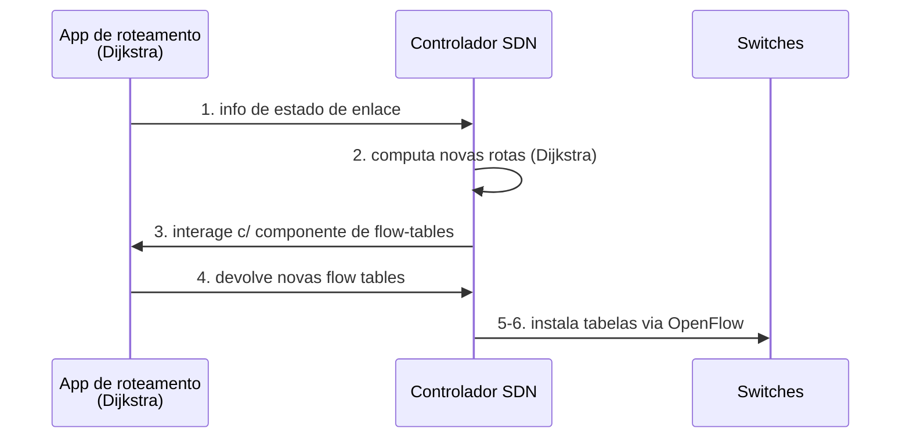

Perfeito, Robson. Vamos abrir o **Dia 1 — Capítulo 5 (Plano de Controle)**. Antes de escrever, vou conferir o conteúdo real dos seus slides da 9ª edição para o resumo bater certinho com o que cai na sua Prova 3.Bom material. Vou conferir vetor de distâncias, OSPF, BGP e SDN para garantir alinhamento.Excelente — tenho o vetor de distâncias completo, com o exemplo de count-to-infinity. Última verificação: OSPF, BGP, SDN e ICMP.Conferido com seus slides da 9ª edição (e com os materiais de Packet Tracer). Está tudo alinhado. Bora pro **Dia 1**, Robson — esse é o capítulo que sustenta as Q1 e Q6 da sua prova-base e dá a base do "boss final" (6.7) do Dia 3.

---

# 📘 DIA 1 — Capítulo 5: Camada de Rede, Plano de Controle

## Mapa do dia

A pergunta-mãe do capítulo é: **"quem decide os caminhos que os pacotes percorrem na rede?"** O Cap. 4 (plano de dados) respondeu _como_ um pacote é jogado da porta de entrada para a de saída. Agora o foco é _como a tabela de encaminhamento é calculada_.

A dependência lógica é essa: você precisa de **estado de enlace** para entender OSPF, e da intuição de **vetor de distâncias** para entender BGP. Por isso o capítulo é estudado em bloco.

---

## 5.1 — Roteamento × Encaminhamento (a distinção que cai sempre)

Essa diferença apareceu literalmente na Q10 do seu gabarito anterior. Memorize a dicotomia **macro × micro**:

|               | **Roteamento (Routing)**                           | **Encaminhamento (Forwarding)**                                 |
| ------------- | -------------------------------------------------- | --------------------------------------------------------------- |
| Plano         | **Controle**                                       | **Dados**                                                       |
| Escala        | Rede inteira (fim-a-fim)                           | Local (um roteador)                                             |
| Velocidade    | Lento (segundos/ms)                                | Rápido (nanossegundos)                                          |
| O que faz     | _Calcula_ os melhores caminhos e constrói a tabela | _Consulta_ a tabela e move o pacote da porta de entrada → saída |
| Implementação | Software (CPU do roteador / controlador)           | Hardware (ASIC)                                                 |

> 💡 **Reflexão crítica:** roteamento é "planejar a viagem com o mapa"; encaminhamento é "virar à direita no cruzamento". A separação importa porque é exatamente o que o **SDN** explora — ele _arranca_ o roteamento de dentro do roteador e o centraliza.

**Duas abordagens de implementação do plano de controle:**

---

## 5.2 — Algoritmos de roteamento (o núcleo do dia)

### Abstração de grafo

A rede vira um grafo $G = (N, E)$, onde $N$ são os roteadores e $E$ os enlaces. Cada enlace tem um custo $c_{a,b}$ definido pelo operador — pode ser sempre $1$ (conta saltos), ou inversamente proporcional à banda, ou ao congestionamento. Se não há enlace direto, $c_{a,b} = \infty$.

### Classificação (cai em V/F — Q1)

| Critério       | Tipo 1                                                            | Tipo 2                                                                    |
| -------------- | ----------------------------------------------------------------- | ------------------------------------------------------------------------- |
| **Informação** | **Global** (todos conhecem a topologia toda) → _estado de enlace_ | **Descentralizado** (cada nó só conhece vizinhos) → _vetor de distâncias_ |
| **Dinâmica**   | **Estático** (rotas mudam devagar)                                | **Dinâmico** (mudam rápido, por updates periódicos ou eventos)            |

---

### 🔵 A) Estado de Enlace — Algoritmo de Dijkstra

**Ideia central:** cada roteador faz um _link-state broadcast_ (inunda a rede com o custo de seus enlaces). Depois disso, **todos têm a topologia completa** e cada um roda Dijkstra localmente para achar os caminhos de menor custo a partir de si.

**Notação:**

- $D(v)$: estimativa atual do custo do caminho mínimo da origem até $v$
- $p(v)$: nó predecessor de $v$ no caminho
- $N'$: conjunto de nós cujo caminho mínimo já é **definitivo**

**O laço de Dijkstra:**

$$
D(v) = \min\big(D(v),\; D(w) + c_{w,v}\big)
$$

a cada iteração, escolhe-se o nó $w \notin N'$ de menor $D(w)$, adiciona-se a $N'$, e relaxam-se seus vizinhos.

#### Exemplo passo a passo (o grafo dos seus slides)

Origem = $u$. Grafo com custos:

| Step | $N'$     | $D(v),p$  | $D(w),p$  | $D(x),p$  | $D(y),p$  | $D(z),p$  |
| ---- | -------- | --------- | --------- | --------- | --------- | --------- |
| 0    | $u$      | $2,u$     | $5,u$     | **$1,u$** | $\infty$  | $\infty$  |
| 1    | $ux$     | $2,u$     | $4,x$     |           | **$2,x$** | $\infty$  |
| 2    | $uxy$    | **$2,u$** | $3,y$     |           |           | $4,y$     |
| 3    | $uxyv$   |           | **$3,y$** |           |           | $4,y$     |
| 4    | $uxyvw$  |           |           |           |           | **$4,y$** |
| 5    | $uxyvwz$ |           |           |           |           |           |

**Como ler (o examinador quer ver a derivação, não só o resultado):**

- **Step 0:** inicializa com custos diretos. Menor fora de $N'$: $x$ (custo 1) → entra.
- **Step 1:** relaxa vizinhos de $x$. $D(w)=\min(5,\,1{+}3)=4$; $D(y)=\min(\infty,\,1{+}1)=2$. Empate entre $v$(2) e $y$(2) → desempate arbitrário, escolhe $y$.
- **Step 2:** relaxa vizinhos de $y$. $D(w)=\min(4,\,2{+}1)=3$ (via $y$); $D(z)=\min(\infty,\,2{+}2)=4$. Menor: $v$(2) → entra.
- **Step 3–4:** $w$(3) e depois $z$(4) entram. Note que $D(z)$ ficou em 4 via $y$, pois $3{+}5=8 > 4$.

**Tabela de encaminhamento resultante em $u$** (extraída da árvore de menor custo):

| Destino | Enlace de saída | Custo |
| ------- | --------------- | ----- |
| $v$     | $(u,v)$ direto  | 2     |
| $x$     | $(u,x)$ direto  | 1     |
| $y$     | $(u,x)$         | 2     |
| $w$     | $(u,x)$         | 3     |
| $z$     | $(u,x)$         | 4     |

> 📌 Repare: _todos os destinos menos $v$_ saem por $(u,x)$. O enlace barato $u$–$x$ vira a "porta de entrada" da rede para $u$.

**Complexidade e limitações:**

- $n$ iterações, cada uma checando até $n$ nós → $O(n^2)$ (melhorável para $O(n\log n)$ com heap).
- Mensagens: cada roteador faz broadcast → complexidade de mensagens $O(n^2)$.
- ⚠️ **Oscilações:** se o custo depende do volume de tráfego, as rotas podem oscilar (todos migram para o enlace "barato", que fica congestionado, e o ciclo se repete). É um ponto crítico de prova.

---

### 🟢 B) Vetor de Distâncias — Equação de Bellman-Ford

**Ideia central:** ninguém conhece a topologia toda. Cada nó só sabe o custo aos vizinhos e **troca seu vetor de distâncias** periodicamente com eles. A informação se difunde iterativamente pela rede.

**Equação de Bellman-Ford** (programação dinâmica):

$$
D_x(y) = \min_{v}\big\{\, c_{x,v} + D_v(y) \,\big\}
$$

onde o mínimo é tomado sobre **todos os vizinhos $v$ de $x$**. O vizinho que atinge o mínimo é o **próximo salto** no caminho.

#### Exemplo (dos seus slides)

$u$ quer alcançar $z$. Os vizinhos $v, x, w$ já anunciaram: $D_v(z)=5$, $D_x(z)=3$, $D_w(z)=3$.

$$
D_u(z) = \min
\begin{cases}
c_{u,v} + D_v(z) = 2 + 5 = 7 \\
c_{u,x} + D_x(z) = 1 + 3 = \mathbf{4} \\
c_{u,w} + D_w(z) = 5 + 3 = 8
\end{cases}
= 4 \quad \text{(próximo salto: } x\text{)}
$$

**Características operacionais:**

- **Iterativo e assíncrono:** cada nó recalcula quando muda um custo local _ou_ chega um vetor de vizinho.
- **Distribuído e auto-terminável:** o nó só avisa os vizinhos **se** seu vetor mudou. Sem mudança → sem mensagem.

#### O problema do count-to-infinity (cai em prova!)

- **"Good news travels fast":** se um enlace _barateia_, a boa notícia se propaga rápido.
- **"Bad news travels slow":** se o enlace $y$–$x$ _encarece_ de 4 para 60, surge um laço de roteamento:
  - $y$ vê custo direto 60, mas $z$ anunciou caminho de custo 5 → $y$ calcula "6 via $z$".
  - $z$ aprende "7 via $y$" → $y$ aprende "8 via $z$" → ... sobe de 1 em 1 até estabilizar. Lentíssimo.

> 💡 **Reflexão:** o count-to-infinity existe porque $z$ não sabe que seu "caminho barato para $x$" na verdade _passava por $y$_. Soluções como _poisoned reverse_ e _split horizon_ mitigam, mas não resolvem todos os casos. Isso é uma vantagem estrutural do estado de enlace: lá cada nó tem a topologia completa, então não cria essas ilusões.

---

### Comparação LS × DV (formato clássico das suas provas)

| Aspecto        | **Estado de Enlace (LS)**                                    | **Vetor de Distâncias (DV)**                                    |
| -------------- | ------------------------------------------------------------ | --------------------------------------------------------------- |
| Informação     | Global (topologia completa)                                  | Local (só vizinhos)                                             |
| Algoritmo      | Dijkstra                                                     | Bellman-Ford                                                    |
| Mensagens      | $O(n^2)$, broadcast a todos                                  | Só entre vizinhos                                               |
| Convergência   | $O(n^2)$; pode **oscilar**                                   | Variável; **laços** e **count-to-infinity**                     |
| Robustez       | Anuncia custo errado → afeta só o próprio cálculo de cada nó | Anuncia caminho errado → **propaga pela rede** (_black-holing_) |
| Protocolo real | **OSPF**                                                     | **RIP**, EIGRP                                                  |

---

## 5.3 — OSPF (Open Shortest Path First): roteamento intra-AS

Primeiro, a motivação de **escala**: a Internet tem bilhões de destinos. Não dá para um roteador guardar todos, nem para todos rodarem um único algoritmo "plano". A solução é agregar roteadores em **Sistemas Autônomos (AS)** — e separar:

- **Intra-AS** (dentro de um AS): OSPF, RIP, EIGRP.
- **Inter-AS** (entre ASes): BGP.

**OSPF é estado de enlace clássico:**

- "Open" = especificação pública (≠ proprietário).
- Cada roteador inunda _link-state advertisements_ para todo o AS — **direto sobre IP** (protocolo 89), sem TCP/UDP.
- Cada um monta a topologia completa e roda **Dijkstra**.
- Métricas configuráveis: banda, atraso (não apenas saltos).
- **Mensagens autenticadas** (segurança contra intrusos).

**OSPF hierárquico** (a base da Q sobre "por que não deixar tudo na área 0?"):

- **Dois níveis:** área local + backbone (Área 0).
- LSAs inundam **só dentro da área**; _area border routers_ sumarizam distâncias e anunciam no backbone.
- **Todo tráfego entre áreas passa pela Área 0.** Áreas não-backbone não trocam tráfego diretamente.
- _Por que dividir?_ Numa rede grande, manter a base de estado de enlace idêntica e atualizada em todos os roteadores fica inviável → a hierarquia reduz tabela e tráfego de controle.

> 🛠️ **Aplicação prática (Packet Tracer):** na config Cisco, `router ospf 1` define o process-id e `network 192.168.1.0 0.0.0.255 area 0` associa redes à área 0 — exatamente a hierarquia acima. RIP × OSPF na Cisco: RIP usa saltos e serve redes pequenas; OSPF usa Dijkstra + banda e escala para redes grandes.

---

## 5.4 — BGP (Border Gateway Protocol): roteamento inter-AS

O BGP é o **"cola que mantém a Internet unida"** — o protocolo de roteamento inter-domínio de fato. Ele permite que um AS anuncie: _"estou aqui, alcanço estes destinos, e por este caminho."_

**Duas variantes:**

- **eBGP:** obtém info de alcançabilidade de ASes vizinhos (entre gateways de ASes distintos).
- **iBGP:** propaga essa info para todos os roteadores _internos_ do AS.

**Anúncio de caminhos (path vector):** o BGP não anuncia só custo — anuncia o **AS-PATH** (a sequência de ASes). Quando AS3 anuncia `AS3,X` para AS2, ele _promete encaminhar_ datagramas para $X$. AS2 propaga `AS2,AS3,X`, e assim por diante. O AS-PATH evita laços (se um AS se vê no caminho, rejeita).

**Seleção de rota** (critérios em ordem):

1. **Local preference** (decisão de política / negócio)
2. Menor **AS-PATH**
3. **NEXT-HOP mais próximo** → _hot potato routing_
4. Critérios adicionais

**Hot potato routing:** o AS escolhe o gateway de saída de **menor custo intra-domínio** (joga a "batata quente" para fora o mais rápido possível), **ignorando** o custo inter-domínio.

> 💡 **Reflexão (intra × inter-AS):** dentro do AS, há um único administrador → o foco é **performance**. Entre ASes, há interesses comerciais conflitantes → a **política domina**. É por isso que um provedor pode escolher _não_ anunciar uma rota mesmo que ela exista: ele não quer carregar tráfego de trânsito de graça entre outros ISPs.

---

## 5.5 — SDN (Software-Defined Networking)

**Contexto histórico:** até ~2005, o plano de controle era **distribuído e por roteador** — cada roteador monolítico rodava implementações proprietárias (IP, OSPF, BGP) num SO fechado (Cisco IOS), com _middleboxes_ separadas (firewall, NAT, load balancer). O SDN propõe **arrancar o controle do hardware** e centralizá-lo logicamente.

**As 3 características do SDN (cai direto em V/F — Q1):**

| Característica                                      | O que significa                                                         |
| --------------------------------------------------- | ----------------------------------------------------------------------- |
| **1. Plano de controle separado do plano de dados** | Switches "burros" só encaminham; a inteligência sai deles               |
| **2. Controle logicamente centralizado**            | Um _controlador SDN_ (software) computa as tabelas para todos           |
| **3. Encaminhamento generalizado (match+action)**   | Regras baseadas em campos de enlace/rede/transporte — não só IP destino |

**Como o controlador instala rotas** (interação controle/dados):

**Por que centralizar?**

- Gerência mais fácil (evita misconfigurations, dá flexibilidade aos fluxos).
- "Programar" a rede centralmente é mais simples que via algoritmo distribuído.
- Implementação aberta → fomenta inovação.

> 💡 **Analogia dos slides:** é a revolução _mainframe → PC_. Antes, hardware + SO + apps verticalmente integrados e fechados (inovação lenta). Depois, interfaces abertas e horizontais (microprocessador, SO, apps separados) → indústria gigante e inovação rápida. **Engenharia de tráfego** ilustra bem: forçar tráfego $u\to z$ pela rota `uvwz` em vez de `uxyz` é _difícil_ no roteamento tradicional (você teria que mexer em pesos de enlace e torcer), mas trivial no SDN (você simplesmente programa a flow table).

---

## 5.6 — ICMP (Internet Control Message Protocol)

Protocolo de **mensagens de controle e erro** entre hosts/roteadores. Carregado _dentro_ de datagramas IP. Tem campos **type** e **code**. Os principais para prova:

| Type | Code | Significado                  |
| ---- | ---- | ---------------------------- |
| 3    | 0    | rede de destino inalcançável |
| 3    | 1    | host de destino inalcançável |
| 3    | 3    | **porta** inalcançável       |
| 8    | 0    | echo request (**ping**)      |
| 11   | 0    | **TTL expirado**             |
| 12   | 0    | cabeçalho IP ruim            |

**Traceroute usa ICMP de forma engenhosa:**

- A origem envia conjuntos de segmentos UDP com **TTL crescente** (1, 2, 3, ...).
- O $n$-ésimo roteador no caminho recebe o datagrama com TTL=0 → descarta e devolve **ICMP type 11, code 0** (TTL expirado), incluindo seu IP.
- Medindo o RTT de cada resposta, mapeia-se o caminho salto a salto.
- **Parada:** quando o UDP finalmente chega ao destino, este responde **ICMP type 3, code 3** (porta inalcançável) → a origem para.

---

## 🎯 Amarração com a prova-base

| Questão                                                                                 | Como o Dia 1 resolve                                                 |
| --------------------------------------------------------------------------------------- | -------------------------------------------------------------------- |
| **Q1 (V/F)** ICMP/OSPF/BGP no plano de controle                                         | 5.3 / 5.4 / 5.6 — todos são plano de controle ✔                      |
| **Q1 (V/F)** 3 características do SDN                                                   | tabela do 5.5 ✔                                                      |
| **Q1 (V/F)** OSPF (estado de enlace) × RIP (vetor de distâncias, **não** "de caminhos") | 5.2/5.3 — cuidado com a pegadinha: _vetor de caminhos_ é o **BGP** ✔ |
| **Q6** Estado de enlace × vetor de distâncias                                           | 5.2 inteiro, com os dois exemplos numéricos ✔                        |

---

Esse é o resumo aprofundado do **Dia 1 (Cap. 5)**, Robson. O coração aqui são as duas derivações numéricas (Dijkstra e Bellman-Ford) — são o tipo de coisa que a Q6 cobra "passo a passo".

Quer que eu monte agora a **seção de 10 questões práticas** (4 fáceis / 4 médias / 2 difíceis), na linhagem da sua prova-base, com **gabarito comentado liberado só quando você pedir**? Se sim, posso focá-las em: tabela de Dijkstra, equação de Bellman-Ford, count-to-infinity, comparações LS×DV / OSPF×RIP / BGP, e as 3 características do SDN.
