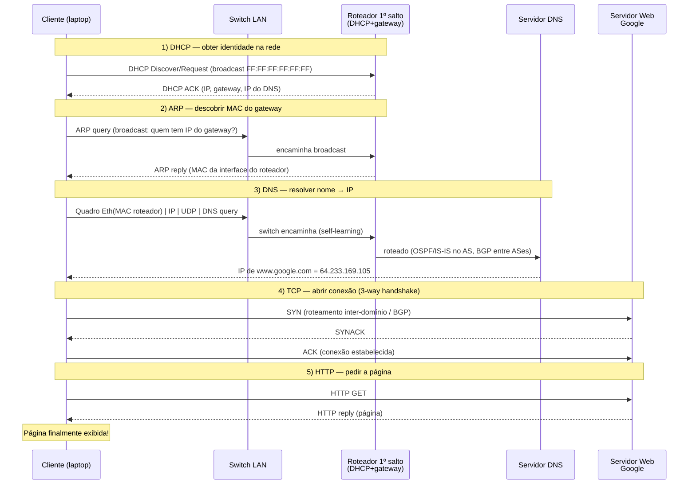
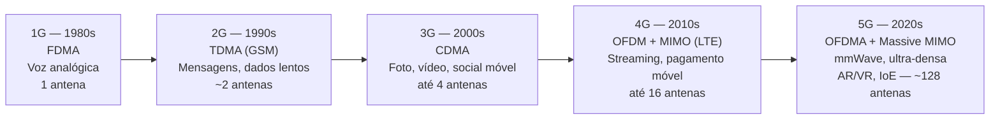
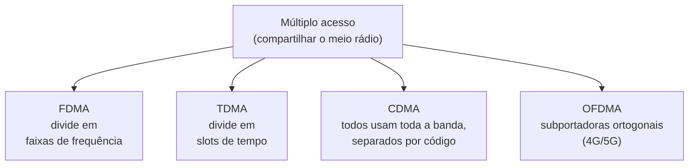
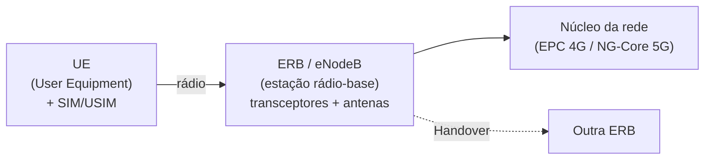

# 📅 Dia 3 — Síntese (6.7) + Redes Móveis

> **Escopo da Prova 3 coberto aqui:** Seção 6.7 (_Um dia na vida de uma requisição web_) como integrador de tudo (Cap. 5 + Cap. 6) e **Introdução às redes móveis/sem fio**.
> **Questões-alvo:** **Q3** e **Q4** (cenário 6.7) ⭐ e **Q5** (evolução celular).

---

## Parte 1 — 6.7: Um dia na vida de uma requisição web

### O cenário (slide 6-101)

Um **cliente móvel** chega à rede e quer abrir `www.google.com`. Esse cenário, que "parece simples", aciona protocolos de **todas as camadas**. É exatamente o que a **Q3** pede: _descrever a execução de todos os protocolos das camadas de enlace e de rede desde a associação à rede até o recebimento da página_.

| Elemento                   | Endereço (slides) |
| -------------------------- | ----------------- |
| Rede da escola/campus      | `68.80.2.0/24`    |
| Rede do provedor (Comcast) | `68.80.0.0/13`    |
| Rede do Google             | `64.233.160.0/19` |
| Servidor Web do Google     | `64.233.169.105`  |

> 💡 **A ordem cronológica é o que vale ponto.** A banca penaliza quem inverte etapas (ex.: colocar DNS antes de DHCP, ou HTTP antes do handshake TCP). Memorize a sequência:
> **DHCP → ARP → (switch) → DNS → roteamento (OSPF/BGP) → TCP → HTTP.**

### A cronologia completa

### Passo a passo comentado

**1. DHCP (slides 6-102 e 6-103) — "entrar" na rede**
O laptop ainda **não tem IP**. Ele precisa de três coisas: seu próprio IP, o IP do **roteador de 1º salto** (gateway) e o IP do **servidor DNS**. O `DHCP Request` é encapsulado em `UDP → IP → quadro 802.3 (Ethernet)` e enviado em **broadcast** (destino `FF:FF:FF:FF:FF:FF`). O roteador, que roda o servidor DHCP, responde com `DHCP ACK`. Resultado: o cliente agora **conhece IP próprio, gateway e DNS**.

**2. ARP (slide 6-104) — antes de DNS, antes de HTTP**
O cliente já montou a query DNS (`UDP → IP → Eth`), mas para enviar o **quadro** ao roteador precisa do **endereço MAC** da interface dele. Aí entra o **ARP**: envia uma `ARP query` em **broadcast** na LAN; o roteador responde com `ARP reply` contendo seu MAC. Só então o quadro com a query DNS pode ser enviado.

> 💡 **ARP é local à sub-rede.** A query ARP só é difundida (broadcast) **dentro da LAN**, não "para toda a rede/Internet". Esse é o erro plantado na **Q1** (a sentença que diz que o host de A manda ARP a _todos os hospedeiros/comutadores/roteadores_ sempre que quer falar com B — na prática ele resolve o MAC do **roteador**, não do destino remoto, e só na própria LAN).

**3. Switch — self-learning (item da Q3)**
O quadro atravessa o **switch** da LAN. O switch é _plug-and-play_: ao ver o **MAC de origem**, registra na tabela de comutação a interface por onde aquele host é alcançável (aprendizado por endereço de origem). Encaminha o quadro para o roteador.

**4. DNS (slide 6-105) — nome → IP**
O datagrama IP com a query DNS sai do cliente, passa pelo switch até o 1º salto, e é **roteado** da rede do campus para a rede da Comcast até o servidor DNS. As tabelas de encaminhamento desses roteadores foram construídas pelos protocolos de roteamento **RIP, OSPF, IS-IS e/ou BGP**. O DNS responde com `64.233.169.105`.

**5. Roteamento OSPF/BGP no caminho**

- **Intra-AS (dentro de um provedor):** OSPF ou IS-IS (estado de enlace) constroem as rotas internas.
- **Inter-AS (entre provedores):** BGP anuncia alcançabilidade entre sistemas autônomos.

> 💡 **Distinção de encapsulamento (cai na Q1):**
>
> - **OSPF** e **ICMP** são encapsulados **diretamente em IP** (OSPF = protocolo 89; ICMP = protocolo 1).
> - **BGP** roda sobre **TCP** (porta **179**).
> - **RIP** é **vetor de distâncias** (não "vetor de caminhos") e roda sobre **UDP** (porta 520). Quem é _path-vector_ é o **BGP**, não o RIP. Cuidado com a pegadinha "RIP utiliza protocolo baseado em vetor de caminhos" → **Falso**.

**6. TCP (slide 6-106) — handshake de 3 vias**
Para enviar o HTTP, o cliente abre um **socket TCP** com o servidor. O `SYN` (passo 1) é roteado **inter-domínio** até o servidor; o servidor responde com `SYNACK` (passo 2); o cliente confirma com `ACK` (passo 3). Conexão estabelecida.

**7. HTTP (slide 6-107) — a página, finalmente**
O `HTTP GET` é injetado no socket TCP; o datagrama IP é roteado até `www.google.com`; o servidor responde com `HTTP reply` (contendo a página). **Página exibida.**

### Tabela-resumo: protocolo × camada × encapsulamento

| Etapa            | Protocolo       | Camada          | Encapsulado em                  | Endereçamento-chave                |
| ---------------- | --------------- | --------------- | ------------------------------- | ---------------------------------- |
| Obter IP         | DHCP            | Aplicação       | UDP → IP → Eth (broadcast)      | MAC destino `FF:FF:FF:FF:FF:FF`    |
| MAC do gateway   | ARP             | Enlace          | quadro Ethernet (broadcast LAN) | resolve IP → MAC, **só na LAN**    |
| Comutação        | (self-learning) | Enlace          | —                               | aprende por **MAC de origem**      |
| Nome → IP        | DNS             | Aplicação       | UDP → IP                        | usa servidor DNS recebido por DHCP |
| Rotas internas   | OSPF/IS-IS      | Rede (controle) | **direto em IP**                | intra-AS                           |
| Rotas entre ASes | BGP             | Rede (controle) | **sobre TCP (179)**             | inter-AS                           |
| Conexão          | TCP             | Transporte      | IP                              | handshake SYN/SYNACK/ACK           |
| Página           | HTTP            | Aplicação       | TCP → IP                        | porta 80/443                       |

> 💡 **Invariante de endereçamento (essencial para Q3 e Q4):**
> **O endereço IP de origem/destino permanece constante fim-a-fim; o endereço MAC muda a cada salto.** Cada vez que o datagrama atravessa um roteador, o quadro de enlace é refeito com novo MAC de origem (interface de saída do roteador) e MAC de destino (próximo salto). O IP do cliente e do servidor web nunca mudam.

### Conectando com a Q4 (cenário com R1, máscara `/27`)

A **Q4** é uma variação aplicada do 6.7: duas sub-redes (LAN X e LAN Y), cliente K na Internet sem IP local, servidor Web B = `192.228.17.57`, máscara `255.255.255.224` (`/27`). Pede **tabela de encaminhamento de R1** + ARP, TCP, OSPF, BGP, DNS, HTTP.

`/27` = `255.255.255.224` → **32 endereços por sub-rede** (30 hosts úteis), blocos de 32 em 32:

$$
2^{32-27} = 2^5 = 32 \text{ endereços} \quad\Rightarrow\quad 30 \text{ hosts úteis por sub-rede}
$$

| Sub-rede | Endereço de rede   | Faixa de hosts | Broadcast |
| -------- | ------------------ | -------------- | --------- |
| LAN X    | `192.228.17.32/27` | `.33` – `.62`  | `.63`     |
| LAN Y    | `192.228.17.64/27` | `.65` – `.94`  | `.95`     |

O servidor B (`.57`) está em **LAN X**. Esqueleto da tabela de R1:

| Rede destino        | Máscara | Interface de saída      |
| ------------------- | ------- | ----------------------- |
| `192.228.17.32`     | `/27`   | porta LAN X             |
| `192.228.17.64`     | `/27`   | porta LAN Y             |
| `0.0.0.0` (default) | `/0`    | porta Internet (uplink) |

Mesma narrativa do 6.7, agora com o roteador fazendo **longest prefix match** para decidir a interface de saída.

---

## Parte 2 — Redes Móveis (Q5)

A **Q5** pede: _evolução das redes celulares de 1G a 5G, técnicas de acesso/multiplexação, serviços e principais características_.

### Linha do tempo 1G → 5G

| Geração | Década | Acesso/Multiplexação | Serviços                             | Característica marcante    |
| ------- | ------ | -------------------- | ------------------------------------ | -------------------------- |
| **1G**  | 1980s  | FDMA                 | Voz (analógica)                      | Antena única               |
| **2G**  | 1990s  | TDMA (GSM/GPRS/EDGE) | Mensagens, dados de baixa velocidade | Digitalização da voz       |
| **3G**  | 2000s  | CDMA (W-CDMA/UMTS)   | Foto, vídeo, plataformas sociais     | Espalhamento espectral     |
| **4G**  | 2010s  | OFDM + MIMO (LTE)    | Vídeo, streaming, pagamento          | IP fim-a-fim, alta taxa    |
| **5G**  | 2020s  | OFDMA + Massive MIMO | AR/VR, _Internet of Everything_      | mmWave, redes ultra-densas |

### Técnicas de múltiplo acesso

- **FDMA** _(Frequency Division Multiple Access)_ — o espectro é dividido em **bandas de frequência**; cada usuário recebe uma banda fixa. Banda não usada fica **ociosa**.
- **TDMA** _(Time Division Multiple Access)_ — acesso em **rodadas**; cada estação ganha um **slot de tempo** fixo por quadro. Slot não usado fica ocioso.
- **CDMA** _(Code Division Multiple Access)_ — **todos transmitem na banda inteira ao mesmo tempo**, separados por **códigos** ortogonais (_spread spectrum_). Analogia do slide: numa festa lotada, falantes de **português** se entendem entre si e "filtram" os de **japonês** — o código é o idioma.
- **OFDMA** — evolução usada em **4G/5G**: divide a banda em muitas **subportadoras ortogonais**, alocadas dinamicamente; combina eficiência espectral com robustez a interferência (base do OFDM+MIMO).

### O conceito de célula e o reuso de frequência

A grande sacada da rede **celular** (vs. sistema convencional de uma antena cobrindo tudo) é **dividir a área em células** e **reusar frequências** em células não adjacentes, multiplicando a capacidade.

**Exercício 1 (slide):** canal de voz = 30 kHz; banda total = 25 MHz.

$$
\frac{25\,\text{MHz}}{30\,\text{kHz}} = \frac{25\,000\,\text{kHz}}{30\,\text{kHz}} \approx 833 \text{ canais unidirecionais}
$$

**Exercício 2 (slide):** células quadradas, vizinhas que compartilham lado não reusam a mesma banda; cidade com 250 células.

$$
416 \times 250 = 104\,000 \text{ canais} \;\approx\; 125\times \text{ melhor que uma única célula}
$$

> 💡 **Por que reusar funciona:** a potência do sinal cai com a distância, então células suficientemente afastadas podem usar a **mesma frequência** sem interferência mútua. É o que viabiliza atender milhões de assinantes com espectro limitado.

### Componentes e mobilidade

- **UE** _(User Equipment)_ — terminal/smartphone; precisa do **SIM/USIM** (identidade única do assinante).
- **ERB / eNodeB** — estação rádio-base. No 4G chama-se **eNB** (_evolved Node B_): "e" de evolução sobre o 3G, "Node B" da estação, "B" de _Base Station_.
- **Handover/Handoff** — transferência da conexão de uma ERB para outra quando o usuário se move, mantendo a chamada/sessão ativa.
- **Location Update** — atualização da localização do terminal na rede.

### Licenciado × não-licenciado e Wi-Fi × celular

| Aspecto                   | **Celular (licenciado)**                                 | **Wi-Fi (não-licenciado)**              |
| ------------------------- | -------------------------------------------------------- | --------------------------------------- |
| Espectro                  | Banda **comprada/licenciada** pela operadora (exclusiva) | Bandas **ISM** livres (2,4 / 5 GHz)     |
| Controle de interferência | Alto (uso exclusivo) → **QoS previsível**                | Baixo (contenção) → interferência comum |
| Acesso ao meio            | FDMA/TDMA/CDMA/OFDMA coordenados pela ERB                | CSMA/CA (contenção, _random access_)    |
| Cobertura                 | Ampla (células km)                                       | Curta (dezenas de metros)               |
| Custo de entrada          | Altíssimo (leilões de espectro)                          | Baixo (equipamento barato)              |
| Padronização              | **3GPP** (3G, LTE, 5G)                                   | **IEEE 802.11**                         |

> 💡 **Trade-off central:** licenciado troca **custo** por **garantia de qualidade**; não-licenciado troca **gratuidade** por **interferência e melhor-esforço**. Por isso o celular sustenta serviços de tempo-real em larga escala e o Wi-Fi domina ambientes locais.

### Órgãos de padronização (podem aparecer na Q5)

- **ITU** — telecom em geral (fixa, móvel, satélite, TV).
- **IETF** — protocolos da Internet (IP, TCP, HTTP, DNS).
- **IEEE** — 802.3 (Ethernet), 802.11 (Wi-Fi), 802.15 (Bluetooth).
- **3GPP** — especificações de 3G, LTE e 5G.
